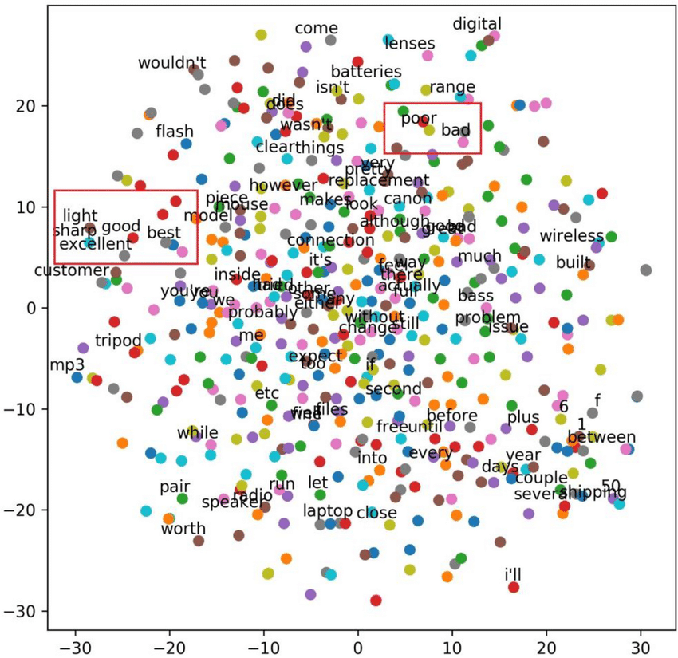
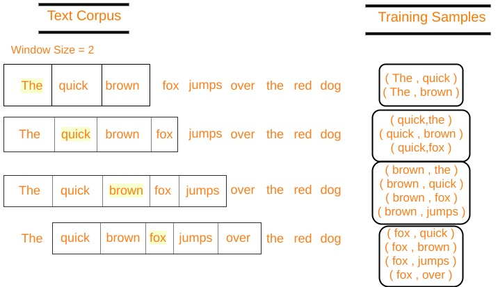
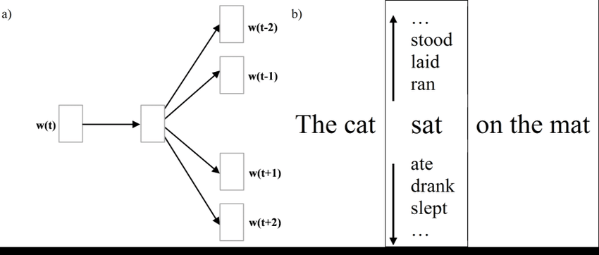
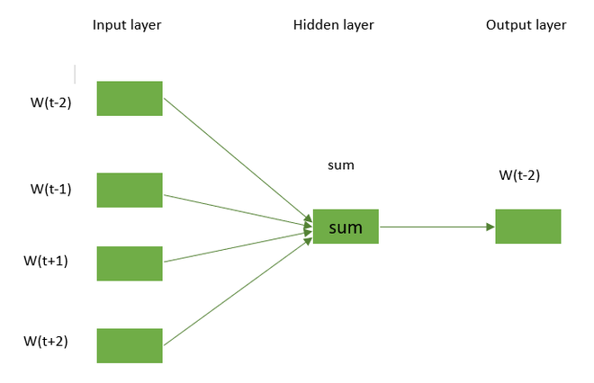

# Word-Embedding-PyTorch

**`Word Embeddings` are a representation of the *`semantics of a word`*, efficiently encoding semantic information that might be relevant to the task at hand.**



- Converting Words to **vector** form, that contains the semantic information of the word.
- This Embedding can be used as the input to the model, to perform the task like `Sentiment Analysis`, `Named Entity Recognition`, `Part of Speech Tagging`, etc.
- PyTorch provides a module `nn.Embedding` to create and use Word Embeddings.
- It can be trained on the large corpus of text, or can be used as the pre-trained model.

---

## Training Word Embeddings

1. N-Gram
2. Skip-Gram
3. Continuous Bag of Words (CBOW)
4. Using Pre-trained Word Embeddings (GloVe, Word2Vec, FastText)

---

## N-Gram

- N-Gram is a contiguous sequence of `n` items from a given sample of text or speech.


```markdown
sentence = "The quick brown fox jumps over the lazy dog"

# Unigram
[The, quick, brown, fox, jumps, over, the, lazy, dog]

# Bigram
[The quick, quick brown, brown fox, fox jumps, jumps over, over the, the lazy, lazy dog]

# Trigram
[The quick brown, quick brown fox, brown fox jumps, fox jumps over, jumps over the, over the lazy, the lazy dog]

# --------------------

## Input & Output

input | output
-------|-------
The quick | brown
quick brown | fox
brown fox | jumps
fox jumps | over
jumps over | the
over the | lazy
the lazy | dog
```

---

## Skip-Gram

- Skip-gram is a method to **predict the context words from the target words**.

- **one input word** is used to **predict the surrounding words**.



```markdown
# Example
sentence = "The quick brown fox jumps over the lazy dog"

# Input & Output
input   |    output
------- | ----------------------------
brown   | (quick The) (fox jumps)
fox     | (brown quick) (jumps over)
...
```

---

## Continuous Bag of Words (CBOW)

- CBOW is a method to **predict the target words from the surrounding context words (words before and after)**.



```markdown
# Example
sentence = "The quick brown fox jumps over the lazy dog"

# Input & Output
input | output
-------|-------
(quick The) (fox jumps) | brown
(brown quick) (jumps over) | fox
...
```
